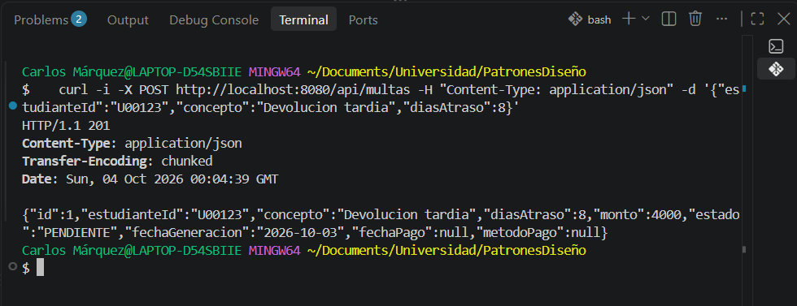
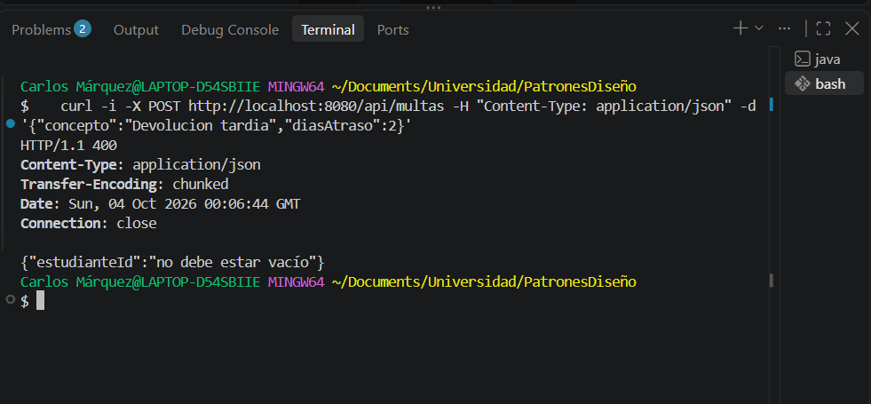
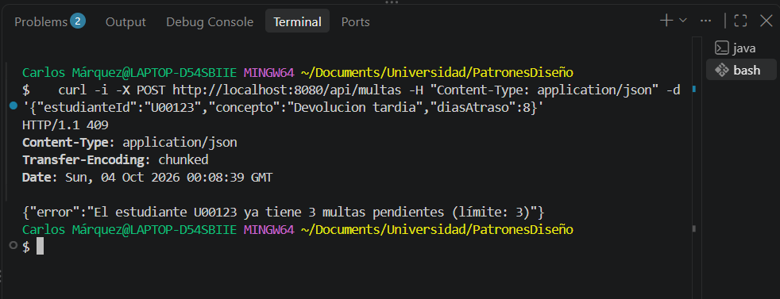
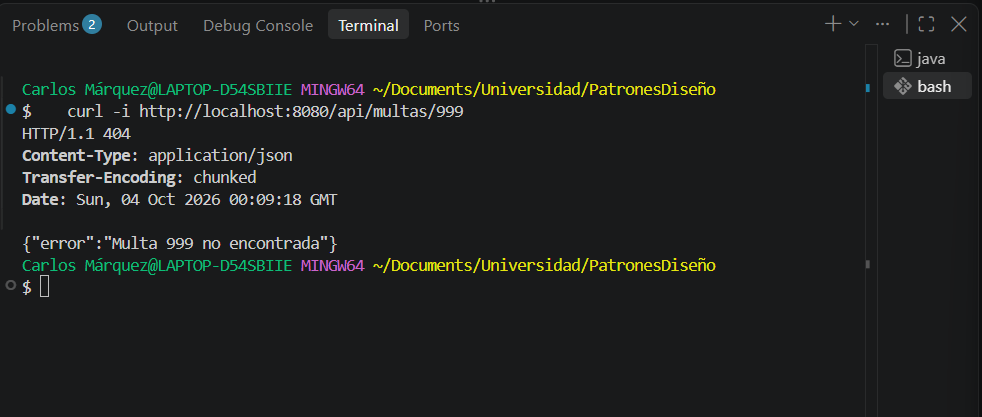
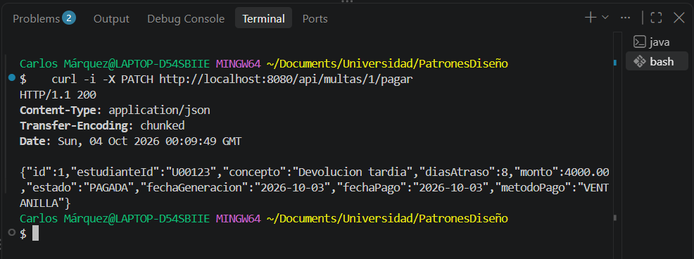
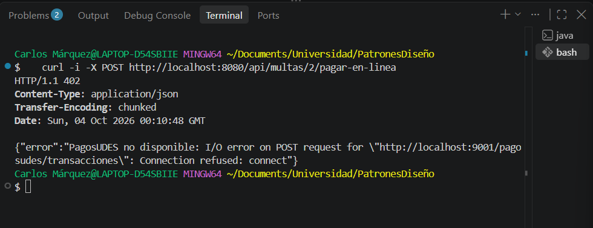
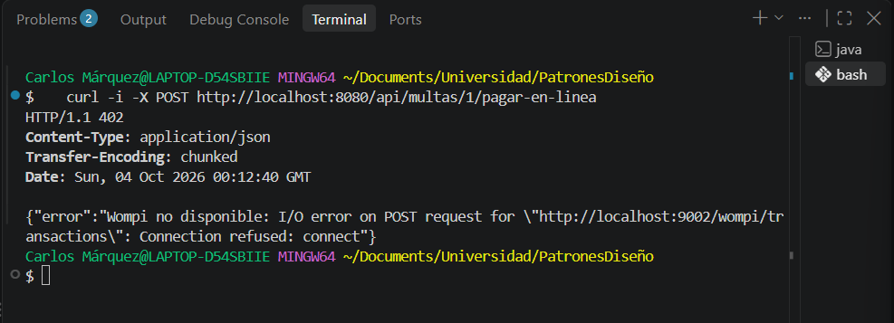

# Post-contenido — Unidad 7: Patrones Arquitectónicos I

## Descripción
Repositorio del post-contenido de la Unidad 7 de Patrones de Diseño
de Software. Un unico proyecto Spring Boot (multas-biblioteca-api)
para la gestion de multas de biblioteca, con dos partes: una API REST
en capas (Model, Repository, Service, Controller) sobre H2, y pago en
linea de multas con dos pasarelas intercambiables.

## Parte 1 — Arquitectura en Capas
MultaRepository extiende JpaRepository y agrega una consulta
agregada (countByEstudianteIdAndEstado). MultaService concentra las
reglas de negocio (limite de multas pendientes, generacion); el
calculo del monto vive en la propia entidad Multa
(Multa.calcularMonto). MultaController expone /api/multas. Ver
paquetes model/, repository/, service/ y controller/.

## Parte 2 — Pago en Linea con Dos Pasarelas
Se eligió la opción C: un puerto de dominio con dos adaptadores, solo
para la parte del pago. domain/port/PasarelaPagoPort y
domain/ResultadoPago son Java puro; infrastructure/pago/PagosUdesAdapter
e infrastructure/pago/WompiAdapter traducen cada formato HTTP externo
al mismo ResultadoPago; se seleccionan por app.pagos.proveedor sin
tocar MultaController ni el resto de MultaService. El resto del
proyecto (Multa, MultaRepository, MultaController) sigue en capas.

Razones para elegir C:

- Cada pasarela tiene un contrato HTTP distinto (PagosUDES responde
  idTransaccion/estadoTransaccion; Wompi trabaja en centavos y responde
  reference/status). Con los adaptadores, esos formatos no llegan a
  MultaService, que solo conoce ResultadoPago.
- El número de pasarelas puede cambiar cuando termine el piloto. Agregar
  una tercera es crear otro adaptador que implemente PasarelaPagoPort;
  quitar una es borrar su adaptador. MultaService no se modifica.

Por qué se descartaron las otras:

- Opción A (if/switch en MultaService): el Service tendría que conocer
  los detalles HTTP de las dos pasarelas y cada pasarela nueva
  agregaría otra rama al mismo método.
- Opción B (Strategy dentro de service/): resuelve el intercambio, pero
  la interfaz quedaría en la capa de servicio junto a clases que hacen
  llamadas HTTP, sin una separación clara entre el dominio y la
  infraestructura.

Estructura de paquetes final:

```
marquez-post1-u7/
└── multas-biblioteca-api/
    └── src/main/java/com/example/multas/
        ├── controller/               (Parte 1 + endpoint /pagar-en-linea)
        ├── service/                  (Parte 1 + PasarelaPagoPort como dependencia)
        ├── model/                    (Parte 1 — sin cambios)
        ├── repository/               (Parte 1 — sin cambios)
        ├── domain/                   ← puerto y modelo de resultado, sin Spring
        │   ├── port/
        │   │   └── PasarelaPagoPort.java
        │   ├── ResultadoPago.java
        │   └── PagoRechazadoException.java
        └── infrastructure/           ← adaptadores, sí conocen Spring y HTTP
            ├── pago/
            │   ├── PagosUdesAdapter.java
            │   └── WompiAdapter.java
            └── config/
                └── RestTemplateConfig.java
```

## Cómo ejecutar
```
$ cd multas-biblioteca-api && mvn spring-boot:run
```

## Herramientas utilizadas
- Java 17, Spring Boot 3.x, Spring Data JPA, H2, RestTemplate
- Apache Maven, Postman/curl, Git, GitHub

## Decisiones de diseño

### Punto de decisión 1 — Cálculo del monto: ¿entidad o Service?
`Multa.calcularMonto` está en la entidad porque el monto solo depende
de los días de atraso que recibe como parámetro (500 por día con tope
de 15.000). El criterio fue: si la regla no necesita ningún colaborador
externo (Repository u otro Service), puede vivir en el propio objeto de
dominio, porque describe cómo se comporta una multa y no cómo se
orquesta un caso de uso.

La alternativa era un método privado en MultaService. Funcionaría, pero
Multa quedaría como un contenedor de datos sin comportamiento (modelo
anémico) y cualquier otra parte que necesitara recalcular un monto
tendría que duplicar la fórmula o pasar por el Service sin necesidad.

### Punto de decisión 2 — Conteo de multas pendientes: ¿consulta o filtrado en memoria?
Contar las multas pendientes de un estudiante sí necesita datos de la
base de datos. Se usa `countByEstudianteIdAndEstado`, que Spring Data
traduce a un COUNT en SQL. La decisión de negocio (si se permite generar
otra multa) la toma MultaService, pero el dato se calcula en la base de
datos, que devuelve solo un número.

La alternativa era traer todas las multas con `findByEstudianteId` y
filtrarlas con streams. Con miles de multas por estudiante, cada multa
nueva cargaría todo el historial en memoria y el tiempo de respuesta
crecería con ese historial.

### Punto de decisión 3 — Selección del adaptador activo
Se usó `@ConditionalOnProperty` en cada adaptador: según
app.pagos.proveedor solo existe uno de los dos beans (PagosUdesAdapter
o WompiAdapter), y MultaService pide por constructor un único
PasarelaPagoPort, sin @Qualifier ni condicionales.

La alternativa era inyectar un `Map<String, PasarelaPagoPort>` y elegir
la clave en tiempo de ejecución. Da más flexibilidad (permite cambiar
de proveedor sin reiniciar), pero el requisito real es una pasarela
fija por sede durante el piloto, y MultaService tendría que conocer las
claves de configuración de cada proveedor.

### Punto de decisión 4 — Diseño del puerto y el tipo de resultado
ResultadoPago solo tiene campos neutrales (proveedor, exitoso,
referenciaExterna, mensaje). Cada adaptador traduce su respuesta a ese
mismo tipo, así MultaService no distingue entre pasarelas.

Si el puerto devolviera el DTO propio de PagosUDES o el de Wompi,
MultaService tendría que conocer los dos formatos y una tercera
pasarela obligaría a modificarlo. Y si ResultadoPago tuviera un campo
idTransaccion en vez de referenciaExterna, WompiAdapter tendría que
guardar su reference en un campo con el nombre de PagosUDES, lo que
mostraría que el tipo no era neutral.

### Trade-off considerado — Parte 2
Se descartó extender las capas (opciones A y B) y se eligió el puerto
con adaptadores (C). Se ganó que los dos contratos HTTP quedaran
aislados en sus adaptadores y que cambiar de pasarela sea solo cambiar
app.pagos.proveedor. El costo fue de 2 paquetes nuevos (domain/ e
infrastructure/) y 6 clases nuevas, más que con la opción B, que habría
necesitado unas 3 clases sin cambiar la estructura de paquetes. También
hay un concepto adicional (puertos y adaptadores) que debe entender
quien llegue al proyecto.

Si el piloto terminara y quedara una sola pasarela no revertiría la
decisión, porque el puerto seguiría aislando el contrato HTTP de esa
pasarela y quitarlo costaría más que dejarlo. Lo que no haría es llevar
hexagonal al resto del proyecto, porque Multa y MultaRepository no
tienen ese problema.

## Capturas de pantalla
Las pasarelas reales no existen en este laboratorio, por eso el pago en
línea responde 402 con el mensaje del adaptador activo. El mensaje
cambia al cambiar app.pagos.proveedor.

Generar multa (201, con el monto calculado):



Generar multa sin estudianteId (400):



Cuarta multa pendiente del mismo estudiante (409):



Multa inexistente (404):



Pago en ventanilla (200, metodoPago VENTANILLA):



Pago en línea con app.pagos.proveedor=pagosudes (402):



Pago en línea con app.pagos.proveedor=wompi (402):



## Conclusiones
En la Parte 1 aprendí que en una arquitectura en capas no todas las
reglas van en el Service: el cálculo del monto quedó en la entidad
porque no necesita datos externos, y el tope de multas pendientes se
apoya en una consulta del Repository. En la Parte 2 lo más difícil fue
decidir entre extender las capas o introducir el puerto, porque las
tres opciones funcionaban. Lo que definió la decisión fue que cada
pasarela tiene un contrato HTTP distinto y que la cantidad de pasarelas
puede cambiar. También quedó claro que hexagonal se puede aplicar solo
en una parte del proyecto, sin migrar todo.
